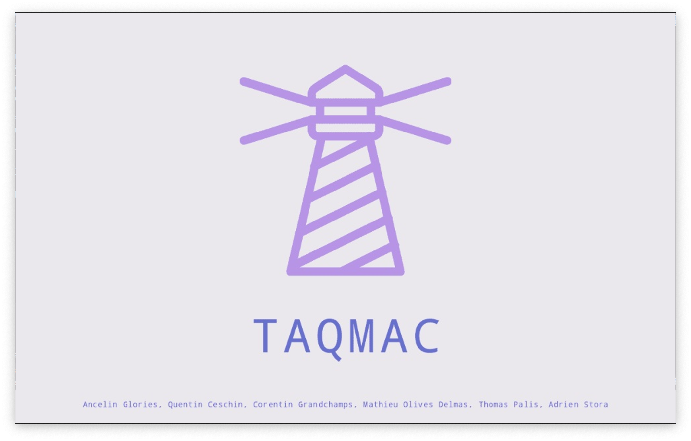
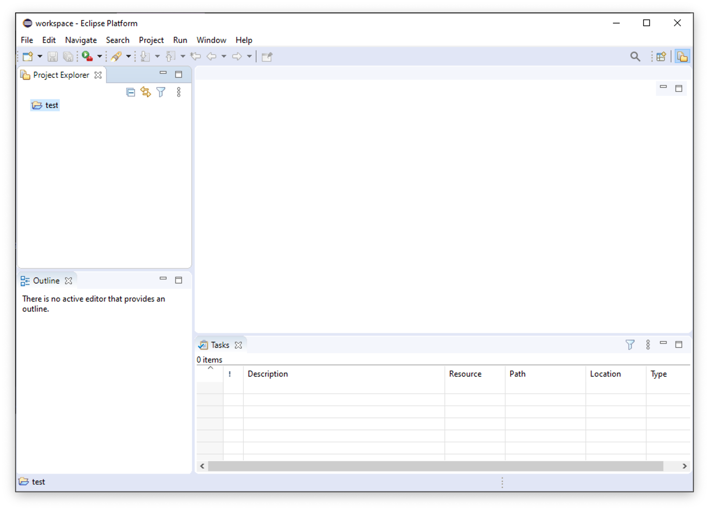
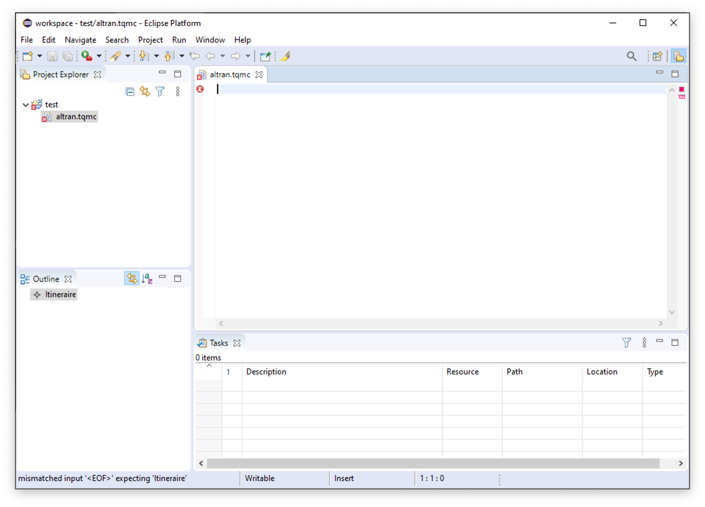

# TAQMAC-Eclipse

## Integrated Development Environment for TAQMAC Domain Specific Language

# Introduction

TAQMAC-Eclipse is an Integrated Development Environment designed to help the final user of TAQMAC Domain Specific Language to write and build his business application.

This IDE is portable, includes all its dependencies and can be used on any Windows 10 (x64) computer.

TAQMAC is a Domain Specific Language thought for assisting webmasters in the creation of _Visit us_ or _Contact_ page of companies websites through a natural language easily understandable by non-developers.

To read documentation about TAQMAC Domain Specific Language, click here [TODO link to taqmac-dsl/dev readme].

# Installation guide

## Prerequisites

- Windows 10 64-bit
- Git (command line interface) or [GitHub Desktop](https://desktop.github.com) application
- 1 Gigabyte of free disk space

## Installation process

1. Clone (or download) this repository anywhere on your computer.

> **Do not put space characters** in the name of the repository folder.

2. Go to the folder where the repository has been cloned.

3. Navigate to `taqmac_ide`.

4. Run `EclipsePortable.exe`.

> NOTE: At its first run, TAQMAC IDE will initialize, which can take a few minutes.

# Use TAQMAC IDE

> NOTE: By default, TAQMAC IDE uses `tacmac_ide/Data/workspace` as its workspace folder. The user can change it.

## Create a TAQMAC project

Open TAQMAC IDE, then :

1. Navigate to **File** &rightarrow; **New** &rightarrow; **Project...**.

2. Select **General** &rightarrow; **Project** then click **Next >**.

3. Enter a name for your project in the field **Project name:** then click **Finish**.

Your TAQMAC project appears in your project list on the left pane of the application.

## Create a .tqmc file

In your TAQMAC project :

1. Navigate to **File** &rightarrow; **New** &rightarrow; **File**.

2. Enter a name **finishing by `.tqmc`** for the file in the field **File name:** then click **Finish**.

3. TAQMAC IDE may ask you if you want to **convert your project to an Xtext Project**. Click **Yes**.

## Save a TAQMAC project

To save a TAQMAC project, you can :

- Type <kbd>Ctrl</kbd> + <kbd>S</kbd>
- Navigate to **File** &rightarrow; **Save**

## Build a TAQMAC project

To build a TAQMAC project and generate the application, you can :

- Type <kbd>Ctrl</kbd> + <kbd>B</kbd>
- Navigate to **Project** &rightarrow; **Build All**

## Deploy a TAQMAC project

To deploy the built TAQMAC project, you can :

TODO push sur taqmac-dsl/master

The deployed TAQMAC project will be then available at this address : [http://taqmac-dsl.herokuapp.com](http://taqmac-dsl.herokuapp.com)

# Frequently Asked Questions

## TACMAC-IDE does not run (first run)

Please check that TAQMAC-Eclipse repository folder does not contain space characters in its name.